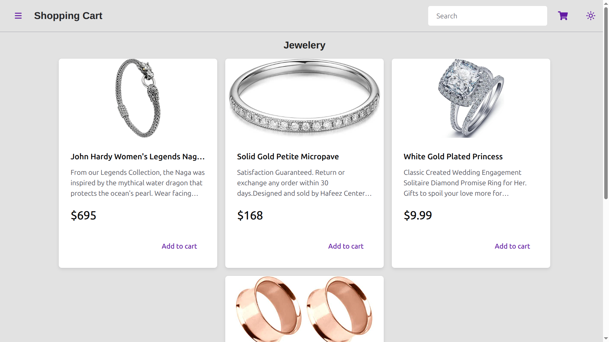
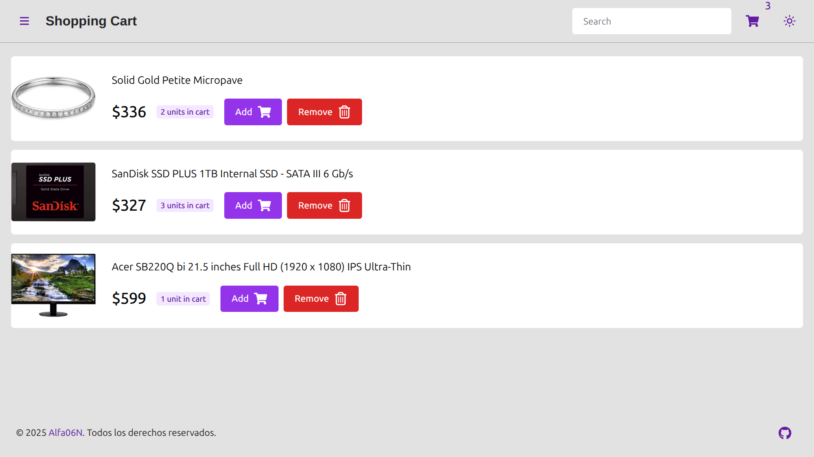

# 🛒 Shopping Cart App

A modern and responsive shopping cart application built with **React**, **Chakra UI**, and the [FakeStore API](https://fakestoreapi.com/). This app allows users to browse products, filter by category, add items to a cart, and manage their selections with ease.

---

## 🌐 Web

Wanna see the web with your own eyes? [Click here](https://shopping-cart-rho-murex.vercel.app/)

---

## 🌟 Features

- ✅ **Homepage**: View all featured products at a glance.
- ✅ **Shop Page**: Browse products by category and add them to your cart.
- ✅ **Cart Page**: Review, update quantities, or remove items from your cart.
- ✅ **Search Functionality**: Find products quickly using the search bar.
- ✅ **Dark/Light Mode Toggle**: Switch between light and dark themes effortlessly.
- ✅ **Responsive Design**: Works great on desktop and mobile devices.
- ✅ **React Router**: For smooth navigation between pages.

---

## 🔧 Technologies Used

| Tool/Library    | Purpose                         |
| --------------- | ------------------------------- |
| React           | JavaScript framework for UI     |
| Vite            | Fast build tool & dev server    |
| Chakra UI       | Component library for styling   |
| React Router v7 | Client-side routing             |
| FakeStore API   | Backend for products/categories |
| Fetch API       | HTTP requests to external API   |

---

## 🖼️ Screenshots

.png>)
_Screenshot of the Home Page of the website._

.png>)
_Screenshot of the Home Page of the website, but dark!._

_Screenshot of the page where you see the products of a category._

_Screenshot of the page where you see the products of your cart._

## License

This project is licensed under the [MIT License](./LICENSE).

Thank you for visiting my Shopping Cart repository! If you like this project, don't forget to star the repository and share it with others!
