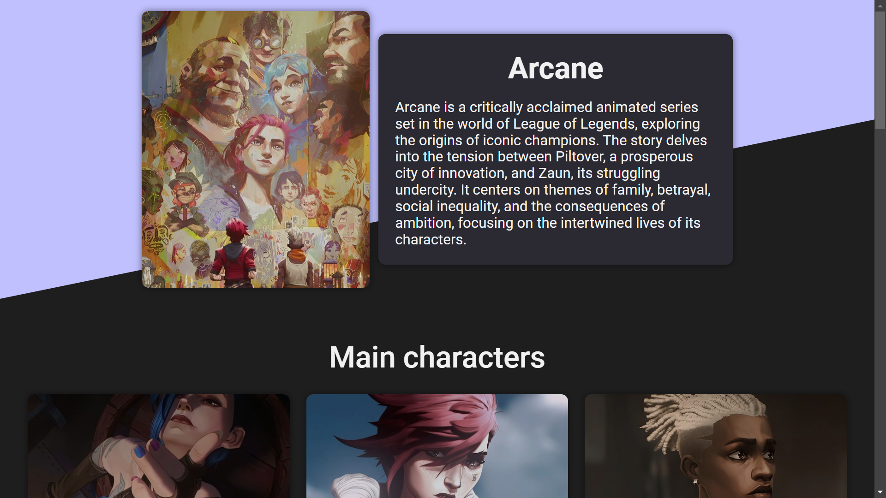
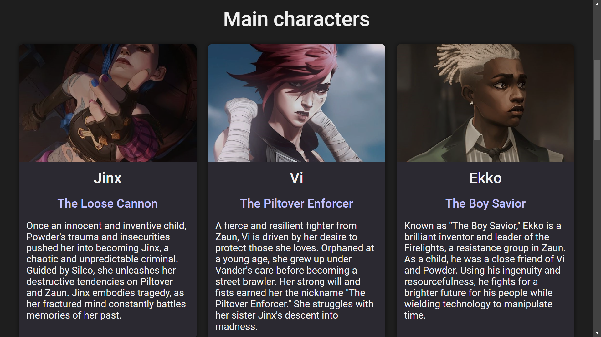
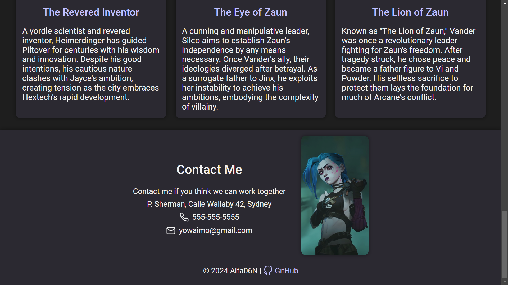

# Homepage Website

Welcome to my Homepage Arcane-themed website project! This is a responsive and visually engaging website inspired by the animated series _Arcane_. The site showcases key characters, themes, and design elements reflective of the show's world and its unique artistic style.

---

## Features

### **Accessibility**

- Fully accessible navigation using `aria-labels` and `aria-describedby`.
- Keyboard-friendly navigation.

### **Responsiveness**

- Adaptable layout for various screen sizes, including desktops, tablets, and mobile devices.
- Smooth transitions for resizing elements such as cards and headers.

### **Design**

- Dark mode and light mode for greater impact and customization.
- Hover and focus effects that enhance user interaction.
- Use of high-quality images representing key characters and settings.

### **Performance Optimizations**

- Lazy loading for images to improve initial page load times.
- Efficient CSS for seamless user experience.

### **Footer**

- Direct link to the project's GitHub repository.

---

## Technologies Used

- **HTML5:** Semantic structure and accessibility features.
- **CSS3:** Modern styling techniques, including transitions, grid layouts, and animations..

---

## Getting Started

### **Prerequisites**

Ensure you have the following installed:

- A modern web browser (e.g., Chrome, Firefox, Edge).
- A code editor (e.g., VS Code) for development purposes.

### **Installation**

1. Clone this repository:
   ```bash
   git clone https://github.com/Alfa06N/Repositorio.git
   ```
2. Navigate to the project folder:
   ```bash
   cd Homepage
   ```
3. Install dependencies:
   ```bash
   npm run install
   ```
4. Run webpack:
   ```bash
   npm run build
   ```
5. Run the project:
   ```bash
   npx webpack server
   ```

---

## Contributing

Contributions are welcome! Please follow these steps:

1. Fork the repository.
2. Create a new branch for your feature or fix:
   ```bash
   git checkout -b feature-name
   ```
3. Commit your changes:
   ```bash
   git commit -m "Add feature description"
   ```
4. Push to your forked repository:
   ```bash
   git push origin feature-name
   ```
5. Open a Pull Request on the main repository.

---

## License

This project is licensed under the [MIT License](LICENSE). Feel free to use and adapt it for your own projects.

---

## Contact

For inquiries or collaborations, feel free to reach out:

- **Email:** nicolasalfag@gmail.com
- **GitHub:** [Alfa06N](https://github.com/Alfa06N)

---

## Screenshots


_Screenshot of the header section._


_Showcase of the main characters' cards._


_Contact details and footer._

---

Thank you for visiting my Homepage Arcane-themed website repository! If you like this project, don't forget to star the repository and share it with others!
